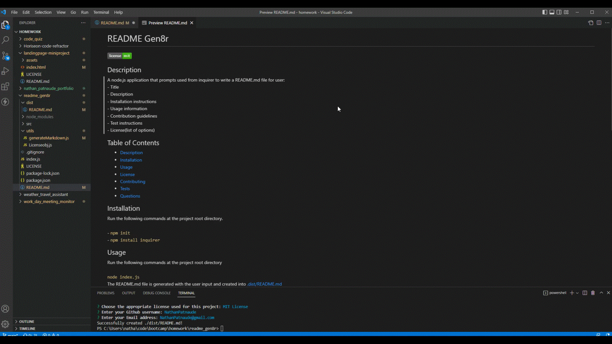

# readme_gen8r


## Description
  
A node.js application that prompts used from inquirer to write a README.md file for user:</br>- Title</br>- Description</br>- Installation instructions</br>- Usage information</br>- Contribution guidelines</br>- Test instructions</br>- License(list of options)


 The README.md file is generated with the user input and created into [.dist/README.md](.dist/README.md)</br></br>[The file showing full functionality of the application](./src/ReadmeGen8rLive.mp4)  
  
## Table of Contents
- [Description](#description)
- [User Story](#user-story)
- [Acceptance Criteria](#acceptance-criteria)
- [Table of Contents](#table-of-contents)
- [Installation](#installation)
- [Usage](#usage)
- [Questions](#questions)

## User Story
  
```
AS A developer
I WANT a README generator
SO THAT I can quickly create a professional README for a new project
```
  
## Acceptance Criteria
  
``` 
GIVEN a command-line application that accepts user input
WHEN I am prompted for information about my application repository
THEN a high-quality, professional README.md is generated with the title of my project and sections entitled Description, Table of Contents, Installation, Usage, License, Contributing, Tests, and Questions
WHEN I enter my project title
THEN this is displayed as the title of the README
WHEN I enter a description, installation instructions, usage information, contribution guidelines, and test instructions
THEN this information is added to the sections of the README entitled Description, Installation, Usage, Contributing, and Tests
WHEN I choose a license for my application from a list of options
THEN a badge for that license is added near the top of the README and a notice is added to the section of the README entitled License that explains which license the application is covered under
WHEN I enter my GitHub username
THEN this is added to the section of the README entitled Questions, with a link to my GitHub profile
WHEN I enter my email address
THEN this is added to the section of the README entitled Questions, with instructions on how to reach me with additional questions
WHEN I click on the links in the Table of Contents
THEN I am taken to the corresponding section of the README
```


## Installation 
Run the following commands at the project root directory.</br></br>- `npm init`</br>- `npm install inquirer`
  
## Usage 
Run the following commands at the project root directory</br></br>`node index.js`

## Questions
[Nathan Patnaude](mailto:Nathanpatnaude@gmail.com) , [GitHub Account](https://github.com/Nathanpatnaude)<br />
This Project is on [GitHub](https://github.com/Nathanpatnaude/readme_gen8r)